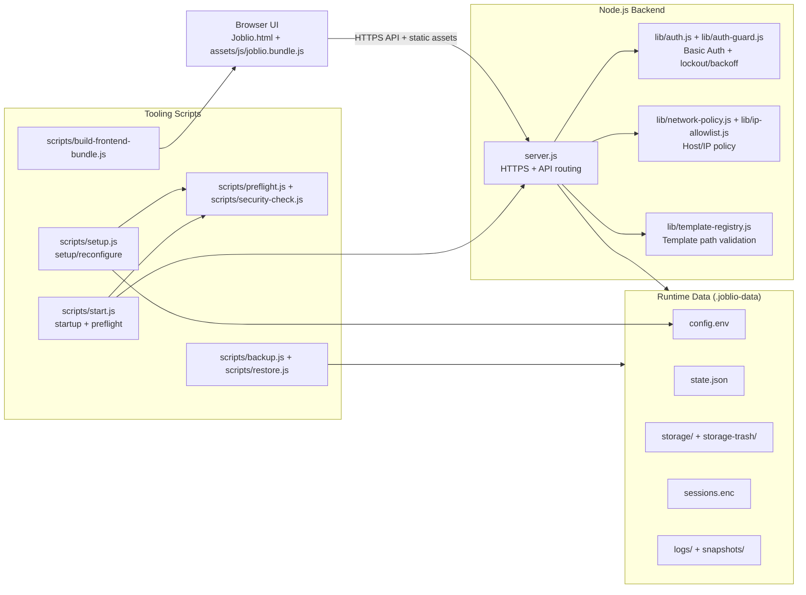
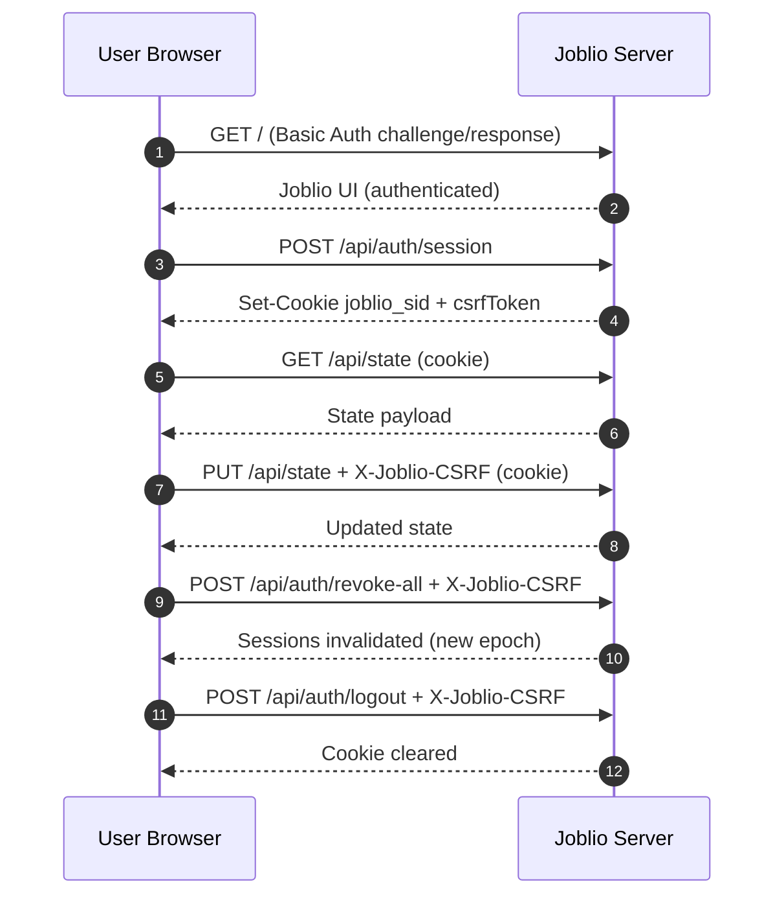

# Joblio
#TODO: Replace placeholder image
A local, single-user job application tracker built to support my job search.


> WARNING: Joblio is built for local/private network use.
> Do not expose it directly to the internet or public interfaces.
> Internet/public deployment is outside supported security scope.


## Table of Contents

- [What Joblio Does](#what-joblio-does)
- [Scope and Non-Goals (for now)](#scope-and-non-goals-for-now)
- [Getting Started](#getting-started)
- [Usage](#usage)
- [Recommended Flows](#recommended-flows)
- [Reconfiguration](#reconfiguration)
- [Development](#development)
- [Docker support](#docker-support)
- [Architecture](#architecture)
- [Connection Model](#connection-model)
- [Technical Reference](#technical-reference)
- [Troubleshooting](#troubleshooting)

## What Joblio Does

- Tracks job applications and status changes
- Stores per-application workspace files
- Supports trash/restore/purge flows for apps and files
- Supports import/export of tracker state
- Supports backup/restore of on-disk data
- Uses auth/session/CSRF/security headers/rate limits

## Scope and Non-Goals (for now)

- Single-user, local/self-hosted
- No multi-tenant isolation model
- No external identity provider integration
- No cloud-managed deployment stack included

## Getting Started

Issues during setup? Jump to [Troubleshooting](#troubleshooting).

### Prerequisites

- [`Node.js 20+`](https://nodejs.org/) ([download](https://nodejs.org/en/download))
- [`OpenSSL`](https://www.openssl.org/) (required only when generating local certs with `npm run tls:gen`; not needed if you already have cert/key files)

### Security First

- Supported deployment: local machine access by default (loopback/localhost).
- Supported (advanced): private-LAN access on trusted local networks with explicit allowlist controls.
- Unsupported deployment: direct public internet exposure.
- Remote internet exposure is unsupported.

Deployment modes (choose one):

- Localhost mode (recommended):
  - Setup choices:
    - `Allow LAN access from other local devices?` -> `No`
    - `Trust proxy headers for client IP?` -> `No` (or `Yes` only when you intentionally run behind a trusted reverse proxy)
    - `IP allowlist file path` -> leave default unless using trusted proxy mode
  - Keep `JOBLIO_ALLOW_LAN=0` (default) and `HOST=127.0.0.1`.
  - Use this mode for single-machine use.
  - Use this mode for reverse proxy deployments.
  - If using a trusted reverse proxy and needing real client IP handling:
    configure `JOBLIO_IP_ALLOWLIST_PATH` first, verify it, and only then enable `JOBLIO_TRUST_PROXY=1`.
  - See [Interactive Setup](#interactive-setup) and [Configuration Reference (`.joblio-data/config.env`)](#configuration-reference-joblio-dataconfigenv).

- LAN mode (direct device access, advanced):
  - Setup choices:
    - `Allow LAN access from other local devices?` -> `Yes`
    - `LAN bind host` -> specific private LAN interface IP (for example `192.168.1.25`)
    - `IP allowlist file path` -> choose/create path
    - `IP allowlist entries` -> include allowed device/subnet entries
    - `Trust proxy headers for client IP?` -> `No`
  - Set `JOBLIO_ALLOW_LAN=1`.
  - Use a specific private interface bind host (no `0.0.0.0` / `::`).
  - Set a non-empty `JOBLIO_IP_ALLOWLIST_PATH` pointing to a file with allowed client IP/CIDR entries (one per line or CSV) and at least one non-loopback entry.
  - For one device, use exact IP or `/32` (example: `192.168.1.25` or `192.168.1.25/32`).
  - `/24` allows the full subnet (example: `192.168.1.0/24` allows most `192.168.1.x` devices).
  - Keep `JOBLIO_TRUST_PROXY=0`.
  - See [Interactive Setup](#interactive-setup) and [Configuration Reference (`.joblio-data/config.env`)](#configuration-reference-joblio-dataconfigenv).

- Run `npm run verify` after configuration changes.
  - See [Reconfiguration](#reconfiguration) and [Recommended Flows](#recommended-flows).

### Quick Start

```sh
git clone https://github.com/affaan-git/joblio.git
cd joblio
npm install
npm run build
npm run tls:gen
npm run setup
npm start
```

Then open the HTTPS URL printed in your terminal and sign in with your configured Basic Auth credentials.
Default mode is local-machine only. Optional LAN mode can be enabled during setup with explicit allowlist enforcement.

### Installation

Clone the repository

```sh
git clone https://github.com/affaan-git/joblio.git
cd joblio
```

Install dependencies

```sh
npm install
```

Build project

```sh
npm run build
```

Create TLS cert/key paths

```sh
npm run tls:gen
```

Start setup

```sh
npm run setup
```

Then start Joblio:

```sh
npm start
```

## Usage

After completing setup from [Installation](#installation), run Joblio with `npm start`, then open the HTTPS URL printed in your terminal and sign in with your configured Basic Auth credentials.

`npm start` will:

- Load `.joblio-data/config.env`
- Run preflight validation
- Start backend server

> The UI URL is printed to the terminal at startup.

Recommended after setup or major changes:

```sh
npm run verify
```

Maintenance reminder:

- Keep Node.js LTS up to date.
- After updating Node.js, run `npm run verify` before your next `npm start`.

Check levels:

- `npm run verify`: quick local validation for normal day-to-day changes.
- `npm run validate:release`: full release gate (quick validation + dependency audit + backup).

## Recommended Flows

First-time setup and run:

```sh
npm install
npm run build
npm run tls:gen
npm run setup
npm start
```

See [Quick Start](#quick-start) for clone + first run in one block.

After configuration changes:

```sh
npm run reconfigure
npm run verify
npm run build   # if frontend source changed
npm start
```

## Reconfiguration

- Run `npm run reconfigure` to edit an existing configuration directly.
- Run `npm run setup` if you want the same setup flow with update prompt behavior.
- `npm run setup` and `npm run reconfigure` automatically run:
  - `preflight`
  - `security-check`
- After config changes, follow [Recommended Flows](#recommended-flows).

## Development

For day-to-day development:

`npm run build` to regenerate the frontend runtime bundle (`assets/js/joblio.bundle.js`) from modular source files.

`npm run dev` to run the backend in watch mode and auto-rebuild/restart during development.

Generated build artifacts:

- `assets/js/joblio.bundle.js` is generated from source modules.
- It is intentionally ignored by Git and Docker context files.
- Rebuild with `npm run build` before `npm start` when frontend source files change.

Validation security tests:

- `npm run lint`
- `npm run verify`
- `npm run security`
- `npm run deps:audit`
- `npm run test:security`
- `npm run validate:release`

## Docker support

Files:

- `Dockerfile`
- `docker-compose.yml`
- `.dockerignore`

First-time container setup:

```sh
cd joblio
docker compose build
docker compose run --rm -it joblio npm run setup
```

Important for Docker setup prompts:

- Joblio binds to localhost-only by default.
- Docker publish is loopback-only by default (`127.0.0.1:8787:8787`).
- Do not publish container ports to non-loopback/public interfaces.
- Configure TLS cert/key paths for container paths during setup (or run `npm run tls:gen` first if you are using local cert files).
- Docker localhost mode (recommended):
  - Keep `JOBLIO_ALLOW_LAN=0`.
  - Keep loopback port publishing (`127.0.0.1:8787:8787`).
  - If using a trusted reverse proxy and needing real client IP handling:
    configure `JOBLIO_IP_ALLOWLIST_PATH` first, verify it, and only then enable `JOBLIO_TRUST_PROXY=1`.
- Docker LAN mode (advanced, direct private-LAN access):
  - Set `JOBLIO_ALLOW_LAN=1`.
  - Set `HOST` to a specific private interface IP.
  - Keep `JOBLIO_TRUST_PROXY=0`.
  - Set `JOBLIO_IP_ALLOWLIST_PATH` to a file containing allowed local clients/subnets.

Start service:

```sh
docker compose up -d
```

Persistent defaults:

- `${JOBLIO_DATA_HOST_PATH:-./docker-data}` -> `${JOBLIO_DATA_DIR:-/app/.joblio-data}`
- `${JOBLIO_BACKUP_HOST_PATH:-./docker-backups}` -> `${JOBLIO_BACKUP_DIR:-/app/backups}`

## Architecture

- Frontend markup: `Joblio.html`
- Frontend styles: `assets/css/joblio.css`
- Frontend scripts:
  - Runtime entry: `assets/js/joblio.bundle.js`
  - Source entry: `assets/js/app.js`
  - Core orchestrator: `assets/js/modules/joblio-core.js`
  - Modules: `assets/js/modules/constants.js`, `dom.js`, `time.js`, `text.js`, `search-filters.js`, `trash.js`, `status-dialog.js`
- Node.js Backend: `server.js` (serves UI and API)
- JavaScript Scripts: `scripts/`
- Data directory: `.joblio-data/`

Single-process Node.js app. No external database required.



## Connection Model



### Authentication

- Global Basic Auth
- API session cookie (`joblio_sid`) required for `/api/*`
- Session cookie attributes:
  - `HttpOnly`
  - `SameSite=Strict`
  - `Secure`

### CSRF

- Required on all write methods (`POST`, `PUT`, `PATCH`, `DELETE`)
- Header: `X-Joblio-CSRF`

### Session

- Idle timeout + absolute timeout
- Sessions are bound to client context (IP + User-Agent) and rejected on binding mismatch
- Encrypted on-disk session store (`sessions.enc`)
- Global revoke-all sessions endpoint

### Request

- Origin/referer checks on writes
- Rate limiting by route family
- Request size limits
- File/path/id validation
- Basic Auth lockout and progressive backoff on repeated failures
- Optional IP allowlist gate

### Response

- Security headers (CSP, frame deny, nosniff, etc.)
- Generic 500 errors (internal error detail hidden)
- Public-safe mapping of thrown 4xx errors

### Network exposure risk

- Joblio is local/private-network only and binds to loopback (`127.0.0.1`) by default.
- Exposing Joblio directly to public networks is unsupported and not recommended.

## Technical Reference

### Interactive Setup

`npm run setup`

Setup prompts for:

- Basic Auth username
- Basic Auth password (8+ chars with letters, numbers, and symbols; hidden; confirmation required)
- LAN mode toggle (off by default)
- Port
- Host bind address (required in LAN mode; private interface IP only)
- Storage data directory
- Backup directory
- TLS cert path
- TLS key path
- Auth session rate limit
- Auth failure window/threshold/lockout
- Auth backoff base/max/start-after
- Auth guard max entries
- Trust proxy headers for client IP
- IP allowlist file path (setup can create it if missing)
- IP allowlist entries (CSV IP/CIDR values written into the allowlist file)
- Resume template paths (CSV, relative to `templates/resume`; blank disables)

Setup output:

- Writes `.joblio-data/config.env`
- Stores password hash only (`scrypt$...`), never plaintext
- Generates random values for:
  - `JOBLIO_API_TOKEN`
  - `JOBLIO_AUDIT_KEY`
- Resume template downloads are disabled when `JOBLIO_RESUME_TEMPLATES` is empty

Setup file permissions:

- Attempts restrictive permissions (`0600`) on config file

Updating existing config:

- Running setup again prompts whether to update existing config
- `npm run reconfigure` opens edit flow directly for existing config

### Configuration Reference (`.joblio-data/config.env`)

These keys are written by setup and used at runtime.

| Key | Default | Purpose |
| --- | --- | --- |
| `JOBLIO_ALLOW_LAN` | `0` | Enable LAN mode (`1` = on, requires explicit IP allowlist) |
| `HOST` | `127.0.0.1` | Bind host (loopback by default; private host required in LAN mode) |
| `PORT` | `8787` | Bind port |
| `JOBLIO_API_TOKEN` | random | Session signing/encryption secret |
| `JOBLIO_BASIC_AUTH_USER` | `joblio` | Basic Auth username |
| `JOBLIO_BASIC_AUTH_HASH` | generated | `scrypt$...` password hash |
| `JOBLIO_AUDIT_KEY` | random | Audit-chain HMAC key |
| `JOBLIO_TLS_CERT_PATH` | `.joblio-data/tls/localhost-cert.pem` | TLS cert path |
| `JOBLIO_TLS_KEY_PATH` | `.joblio-data/tls/localhost-key.pem` | TLS key path |
| `JOBLIO_DATA_DIR` | `.joblio-data` | Runtime state/log/storage root |
| `JOBLIO_BACKUP_DIR` | `backups` | Backup output directory |
| `JOBLIO_COOKIE_SECURE` | `1` | Force `Secure` cookie attribute |
| `RATE_MAX_AUTH_SESSION` | `45` | Auth session requests per rate window |
| `AUTH_FAIL_WINDOW_MS` | `600000` | Failure window for lockout counter |
| `AUTH_FAIL_THRESHOLD` | `5` | Failures before lockout |
| `AUTH_LOCKOUT_MS` | `900000` | Lockout duration |
| `AUTH_BACKOFF_BASE_MS` | `250` | Initial auth failure backoff |
| `AUTH_BACKOFF_MAX_MS` | `2000` | Maximum auth failure backoff |
| `AUTH_BACKOFF_START_AFTER` | `2` | Failure count when backoff starts |
| `AUTH_GUARD_MAX_ENTRIES` | `20000` | In-memory auth guard entry cap |
| `JOBLIO_TRUST_PROXY` | `0` | Trust `X-Forwarded-For` for client IP |
| `JOBLIO_IP_ALLOWLIST_PATH` | empty | Path to allowlist file containing source IP/CIDR entries |
| `JOBLIO_RESUME_TEMPLATES` | empty | CSV list of template file paths under `templates/resume` |

Runtime override policy:

- Joblio locks these config keys from runtime environment overrides in `npm start`.
- Source of truth is the config file.

### Runtime Limits and Tunables

These are server-supported keys (advanced operations) that are not currently prompted in setup.

| Key | Default | Purpose |
| --- | --- | --- |
| `MAX_JSON_BODY_BYTES` | `5242880` | Max JSON body size |
| `MAX_UPLOAD_JSON_BYTES` | `36700160` | Max upload payload size |
| `MAX_FILE_BYTES` | `26214400` | Max decoded file upload size |
| `MAX_APPS` | `10000` | Max app count per section |
| `MAX_SNAPSHOTS` | `20` | Snapshot retention count |
| `LOG_ROTATE_BYTES` | `5242880` | Activity log rotate threshold |
| `PURGE_MIN_AGE_SEC` | `120` | Minimum trash age before purge |
| `RATE_WINDOW_MS` | `60000` | Rate-limit window |
| `RATE_MAX_WRITE` | `180` | Write limit per window |
| `RATE_MAX_UPLOAD` | `24` | Upload limit per window |
| `RATE_MAX_DELETE` | `120` | Delete limit per window |
| `RATE_MAX_IMPORT` | `10` | Import limit per window |
| `RATE_MAX_AUTH_SESSION` | `45` | Auth session limit per window |
| `AUTH_FAIL_WINDOW_MS` | `600000` | Auth failure window |
| `AUTH_FAIL_THRESHOLD` | `5` | Lockout failure threshold |
| `AUTH_LOCKOUT_MS` | `900000` | Lockout duration |
| `AUTH_BACKOFF_BASE_MS` | `250` | Backoff base delay |
| `AUTH_BACKOFF_MAX_MS` | `2000` | Backoff max delay |
| `AUTH_BACKOFF_START_AFTER` | `2` | Backoff starts after this many failures |
| `AUTH_GUARD_MAX_ENTRIES` | `20000` | Auth guard entry cap |
| `JOBLIO_ALLOW_LAN` | `0` | Enable LAN mode (requires explicit IP allowlist) |
| `JOBLIO_TRUST_PROXY` | `0` | Trust `X-Forwarded-For` |
| `JOBLIO_IP_ALLOWLIST_PATH` | empty | Path to allowlist file with allowed IP/CIDR entries |
| `JOBLIO_RESUME_TEMPLATES` | empty | CSV template paths under `templates/resume` |
| `SESSION_TTL_MS` | `28800000` | Session idle timeout |
| `SESSION_ABS_TTL_MS` | `86400000` | Session absolute timeout |

### API Endpoints

Auth/session:

- `POST /api/auth/session`
- `POST /api/auth/logout`
- `POST /api/auth/revoke-all`

State/health:

- `GET /api/state`
- `PUT /api/state`
- `GET /api/health`
- `GET /api/health?verbose=1` (verbose fields are restricted by server policy)
- `GET /api/integrity/verify`

Files:

- `POST /api/files/upload`
- `GET /api/files/:fileId/download`
- `DELETE /api/files/:fileId`
- `POST /api/files/:fileId/restore`
- `DELETE /api/files/:fileId/purge`

Data/template:

- `GET /api/export`
- `POST /api/import`
- `GET /api/template/resume/list`
- `GET /api/template/resume?id=<template-id>` (or without `id` when exactly one template is configured)

### Data Layout

Under `.joblio-data/`:

- `config.env`
- `state.json`
- `storage/`
- `storage-trash/`
- `snapshots/`
- `logs/activity.log`
- `logs/activity.log.1`
- `logs/audit-chain.json`
- `sessions.enc`

### Commands

Core:

- `npm run setup`
- `npm run reconfigure`
- `npm start`

Validation/ops:

- `npm run lint`
- `npm run lint:fix`
- `npm run security`
- `npm run verify`
- `npm run deps:audit`
- `npm run preflight`
- `npm run security:check`
- `npm run test:security`
- `npm run build:frontend:check`
- `npm run validate:release`
- `npm run backup`
- `npm run restore -- --file <backup-directory> --yes`
- `npm run tls:gen`

### Script Index

- `scripts/setup.js` - interactive configuration
- `scripts/start.js` - unified startup path
- `scripts/preflight.js` - startup checks
- `scripts/security-check.js` - config and security posture checks
- `scripts/gen-local-tls.js` - local TLS cert generation helper
- `scripts/security-tests.js` - auth/hash unit tests
- `scripts/check-frontend-bundle.js` - verifies generated frontend bundle is up to date
- `scripts/restore-tests.js` - restore directory path-safety tests
- dependency audit via `npm run deps:audit`
- `scripts/backup.js` - data backup
- `scripts/restore.js` - data restore

Command usage guidance:

- Normal users:
  - `npm run setup` (first-time)
  - After `npm run reconfigure`, follow [Reconfiguration](#reconfiguration)
  - `npm start`
- Developers/maintainers:
  - `npm run build` after frontend module changes
  - `npm run verify` before commit for quick local validation
  - `npm run validate:release` before release for full release-gate validation

## Troubleshooting

<details>
  <summary>Click to expand</summary>

### Setup requires interactive terminal (TTY)

- Symptom: setup exits with a TTY/interactive terminal error.
- Fix: run setup directly in an interactive shell:
  - `npm run setup`

### Missing config at startup

- Symptom: startup fails because `.joblio-data/config.env` is missing.
- Fix:
  - `npm run setup`

### TLS cert/key path errors

- Symptom: startup fails with TLS cert/key missing or invalid path.
- Fix:
  - Generate local certs: `npm run tls:gen`
  - Re-run config and set correct paths: `npm run reconfigure`
  - Follow [Recommended Flows](#recommended-flows) before restart

### Login failures or temporary lockout

- Symptom: repeated auth failures, lockout delay, or 401 responses.
- Fix:
  - Wait for lockout window to expire.
  - Re-enter correct Basic Auth credentials.
  - If needed, run `npm run reconfigure` to set a new password.

### Session appears invalid after network/client changes

- Symptom: requests become unauthorized after environment/client changes.
- Fix:
  - Use UI “Revoke all sessions” and sign in again.

### Security check fails

- Symptom: `npm run security:check` reports missing/invalid config.
- Fix:
  - Run `npm run setup` first.
  - Then run `npm run security:check` again.

### Restore/import path-safety errors

- Symptom: restore/import fails due unsafe backup path or invalid structure.
- Fix:
  - Use backups generated by Joblio (`npm run backup`).
  - Ensure the backup directory contains the expected top-level data directory.

</details>
